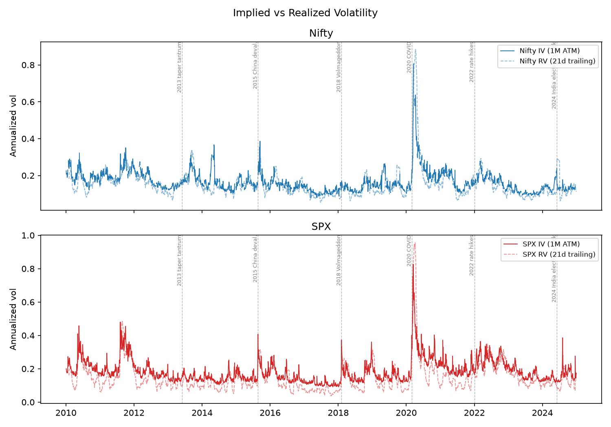
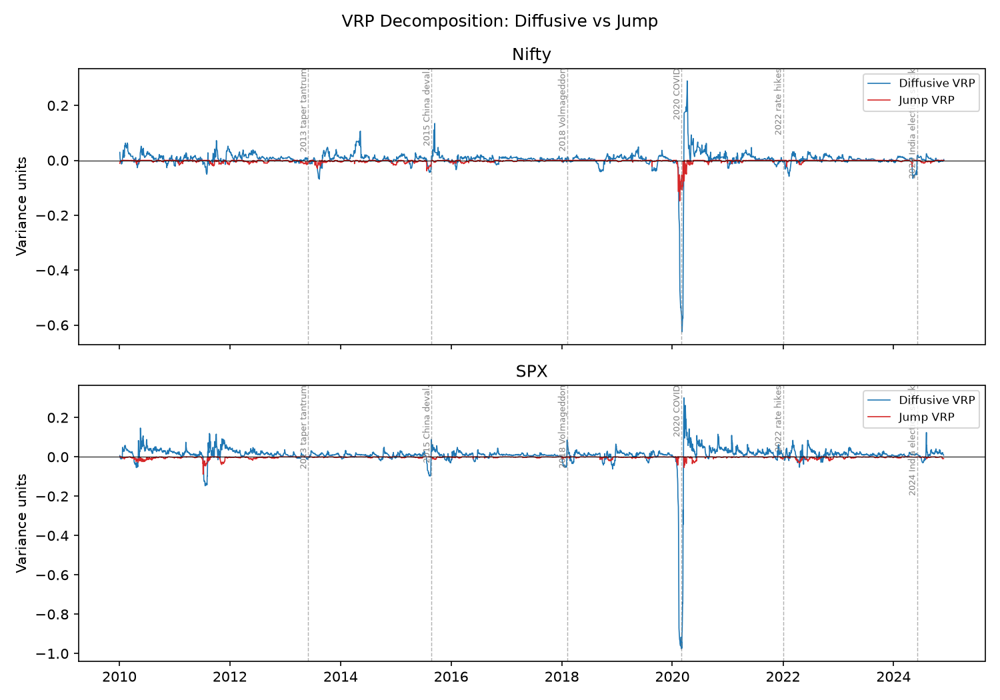
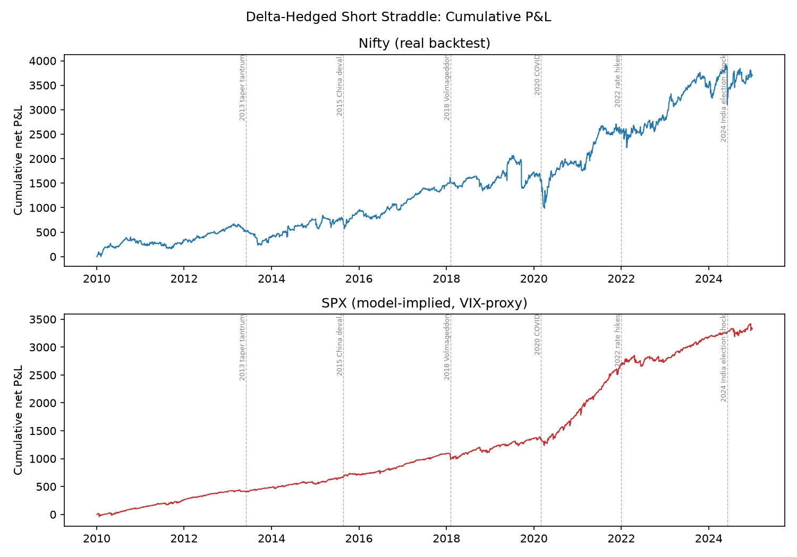
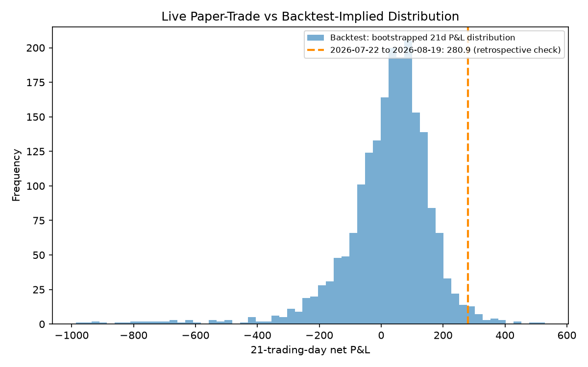

# Cross-Market Volatility Risk Premium: Nifty vs SPX (2010–2024)

A jump/diffusive decomposition of the variance risk premium on an emerging and a developed index options market, with a delta-hedged short-straddle backtest and a live, honestly-reported paper-trade.

## TL;DR

This project tests whether implied volatility is a biased, informative forecast of realized volatility on Nifty 50 and the S&P 500, decomposes the resulting variance risk premium (VRP) into diffusive and jump components (Bollerslev & Todorov, 2011), and backtests a delta-hedged short-ATM-straddle on both. SPX shows a statistically significant VRP (mean 0.0087, t=2.40) driven by a genuine diffusive premium; Nifty's total VRP is insignificant over the full 2010–2024 sample (t=0.65) despite a jump-drag of nearly identical size to SPX's, because its diffusive premium is weaker and sharply regime-dependent — negligible pre-2020, clearly positive after. The strategy is profitable but strongly negatively skewed on both markets (Nifty Sharpe 0.61, skew −7.5; SPX Sharpe 1.67, skew −3.6), with Nifty's worst single day being the June 2024 India-election shock, not COVID; a live paper-trade of the frozen spec started today and will accumulate over the coming weeks. Jump risk, not diffusive risk, is the more stable VRP feature across these two markets.

## Charts






## Headline results

| Metric | Nifty | SPX |
|---|---:|---:|
| Sample (options data) | 2010-01 – 2024-12 | 2010-01 – 2024-12 |
| MZ regression: α, β | 0.005, 0.78 | −0.001, 0.79 |
| MZ: R² | 0.21 | 0.22 |
| MZ joint test (α=0,β=1), p-value | 0.170 (not rejected) | 0.041 (rejected) |
| VRP total: mean (t-stat) | 0.0021 (0.65) | 0.0087 (2.40) |
| VRP diffusive: mean (t-stat) | 0.0039 (1.44) | 0.0095 (2.18) |
| VRP jump: mean (t-stat) | −0.0029 (−5.63) | −0.0028 (−8.26) |
| Jump share of realized variance | 9.7% | 11.2% |
| Strategy Sharpe / skew / kurtosis | 0.61 / −7.5 / 160.8 | 1.67¹ / −3.6 / 39.7 |
| Max drawdown (index-point P&L) | −1,078 | −194¹ |
| Worst single day | −766 (2024-06-04, election shock) | — |

¹ SPX strategy is Black-76 model-priced off VIX, not real quoted option prices — see Limitations.

## Methodology

- **Data**: Nifty from the NSE F&O bhavcopy (Kaggle 2000–2020 + a direct-download extension in `download_bhavcopy.py`, falling back between NSE's legacy and 2024 "UDiFF" archive formats). SPX from `yfinance` (spot + VIX); SPX uses VIX as a reproducible 1M ATM IV proxy, absent a comparable free historical option-chain dataset — standard in the literature, documented in `src/data/clean_spx.py`.
- **IV**: Black-76 on the matched-expiry future, not spot; vectorized-bisection inversion (the original per-row solver took 30+ minutes on the full panel; vectorized bisection reduced runtime to seconds). 1M constant-maturity IV interpolates *total variance* between bracketing expiries.
- **RV / jumps**: 21-day realized variance; jump-robust bipower variation (Barndorff-Nielsen & Shephard, 2004); jump component = max(RV²−BV, 0). Daily-frequency BV provides a directional jump-risk estimate (Andersen, Bollerslev & Diebold, 2007); 5-minute BV would offer greater precision.
- **Regressions**: Mincer-Zarnowitz and encompassing regressions, Newey-West SEs (lag 21) throughout — every regression target overlaps 20 days with its neighbors by construction.
- **VRP decomposition**: an algebraic identity, not two separately-fit models — `VRP_diffusive = IV²−E[BV]`, `VRP_jump = −E[jump]`, and they sum to `VRP_total` exactly (up to bipower's own clipping noise).
- **Strategy**: sell 1 ATM straddle the day after each monthly expiry, delta-hedge daily, hold to settlement. Nifty costs: 0.5bps/leg hedge, 3% option round-trip. SPX: 0.2bps, 1%.

## Cross-market findings

Both markets price jump risk almost identically: a ~10% jump share of realized variance and a highly significant negative jump-VRP component of nearly the same size (−0.0029 vs −0.0028). What differs is the diffusive premium — SPX's is stable and significant across the sample; Nifty's is regime-dependent, statistically indistinguishable from zero pre-2020 and clearly positive after, consistent with the well-documented post-2020 surge in Indian retail options selling compressing realized vol relative to implied. The strategy backtest tells a matching story: both markets show the canonical short-vol signature (strongly negative skew, fat tails), but Nifty's real backtest shows substantial but recoverable drawdowns at each crisis — including a genuine surprise: the strategy's single worst day across 15 years wasn't COVID, it was June 4 2024, when Nifty fell ~6% intraday on an unexpected Indian election result — while SPX's model-based backtest appears smoother than the Nifty backtest through the same events, a direct consequence of pricing off a single flat VIX level with no real quote frictions.

## Limitations

- SPX relies on a model-implied option panel rather than quoted prices (CBOE's free tier isn't a reproducible ongoing source): its strategy P&L is a Black-76 approximation, not a historical backtest, and Part 6's skew/moneyness robustness check is Nifty-only for the same reason.
- The Nifty discount rate is implied from futures cost-of-carry (`r = ln(F/S)/T`), not an independent money-market curve.
- Bipower variation at daily frequency is a noisy jump estimator; treat the jump share as directional.
- The live paper-trade log has one entry so far — 4–8 weeks of honest accumulation, not a finished result, is the point of Part 5. A separate, clearly-labeled retrospective check (same engine, most recent 21 real trading days, 2026-07-22 to 2026-08-19) returned +280.9 — shown as fig4's dashed line, a sanity check against current data, not a substitute for the forward-only log.

## What I'd do with more time

1. Pull real SPX/SPY option chain data (a paid CBOE DataShop subscription) to replace the VIX-proxy synthetic panel with a real backtest.
2. An independent USD/INR short-rate curve instead of the futures-implied cost-of-carry approximation.
3. Intraday (5-min) bipower variation for a more precise jump estimate.
4. The optional Part 6 robustness checks (Nifty weekly-expiry VRP compression, term structure, skew premium).
5. A walk-forward (not in-sample) HAR-RV forecast, with a proper train/test split.

## Reproduce

```bash
pip install -r requirements.txt
python run.py                          # regenerates every processed file, table, and figure
python -m src.live.update_daily        # advances the live paper-trade by one day (run daily)
```

`data/raw/fobhav.csv` (the Kaggle NSE F&O dump) must be placed manually — it's gitignored for size. See `analysis.ipynb` for the full narrative walkthrough.
